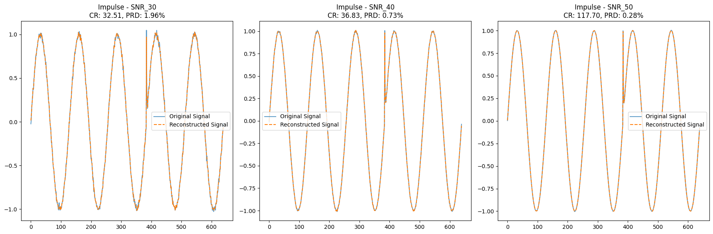
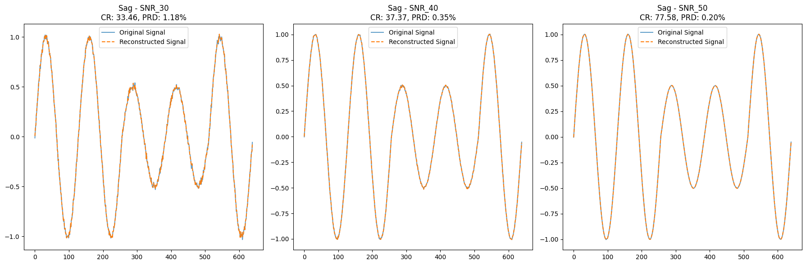

# Hybrid Compression for Power Quality Disturbance Signals
This repository contains the Python implementation of a hybrid compression method for compound power quality disturbance (PQD) signals, as described in the paper:

> "A Hybrid Compression Method for Compound Power Quality Disturbance Signals in Active Distribution Networks"**  
   *Authors: Xiangui Xiao, Kaicheng Li, and Chen Zhao*  
   Published in: *Journal of Modern Power Systems and Clean Energy, November 2023*

The code replicates the methodologies from the paper, integrating Huffman coding, run-length encoding, sparse decomposition, wavelet thresholding, and a strong tracking Kalman filter (STKF) to achieve efficient PQD signal compression. It balances compression ratio (CR) and reconstruction accuracy (percentage RMS difference, PRD), demonstrating robustness against noise and varying sampling rates.

## Features
- **Signal Generation**: Supports synthetic PQD signals such as impulse, sag, and decaying harmonics.
- **Compression Algorithms**: Implements wavelet-based compression with:
  - Huffman encoding for approximation coefficients (`a3`).
  - Run-length encoding (RLE) for detail coefficients (`d3`, `d2`, `d1`).
- **Noise Robustness**: Simulates PQD signals with Gaussian noise at various SNR levels (30 dB, 40 dB, 50 dB).
- **Metrics Calculation**:
  - Compression ratio (CR).
  - Percentage root mean square difference (PRD).
- **Decompression and Reconstruction**: Fully reversible process for signal reconstruction.

## Methodology
The hybrid compression method follows these steps:
1. **Sparse Decomposition**:
   - Splits the PQD signal into transient components (TC) and steady-state components (SSC) using an overcomplete dictionary (`[I, H]`, identity matrix and Hartley transform matrix).
2. **Kalman Filter and Wavelet Analysis**:
   - STKF computes a fading factor (FF) to dynamically adjust wavelet thresholds.
   - Wavelet decomposition (using `db4` wavelet) separates approximation (`a3`) and detail coefficients (`d3`, `d2`, `d1`).
3. **Compression**:
   - Huffman encoding compresses approximation coefficients (`a3`).
   - Run-length encoding compresses sparse detail coefficients (`d3`, `d2`, `d1`).
4. **Steady-State Component Compression**:
   - FFT is used to zero out insignificant coefficients (below a threshold).
   - Only non-zero coefficients and their positions are retained.
5. **Decompression**:
   - Huffman decoding and RLE decoding reconstruct the original coefficients.
   - The signal is reconstructed via inverse wavelet transform and FFT.

For more details, refer to the **[Paper](paper.pdf)**.


## Installation

### Requirements
Ensure you have Python 3.8+ installed. Install the dependencies listed in `requirements.txt`:
```bash
pip install -r requirements.txt
```

## Usage

The main script is `implementation.py`. To execute:
```bash
python implementation.py
```
It gives the following: 
1. **Signal Visualization**:
   - Plots the original and reconstructed signals for each PQD type and SNR level.
   - Annotates plots with compression ratio (CR) and PRD metrics.
2. **Detailed Metrics**:
   - Prints CR, PRD, and size details in the console for all signal types and SNR levels.

## Results

### Metrics
For synthetic PQD signals, the results obtained are:
| Signal Type            | Compression Ratio (SNR 30) | PRD (SNR 30) | Compression Ratio (SNR 40) | PRD (SNR 40)  | Compression Ratio (SNR 50) | PRD (SNR 50) |
|------------------------|--------------------------|--------------|--------------------------|--------------|--------------------------|--------------|
| Impulse Signals           | 32.51                     | 1.96%        | 36.83                     | 0.73%        | 117.70                    | 0.28%        |
| Sag Signals               | 33.46                     | 1.18%        | 37.37                     | 0.35%        | 77.58                     | 0.20%        |
| Decaying Harmonics Signals | 33.57                     | 5.93%        | 37.17                     | 5.87%        | 52.92                     | 5.87%        |


### Visual Outputs




## Acknowledgments
This work is based on the methodologies described in the paper:
- Xiangui Xiao, Kaicheng Li, and Chen Zhao, **"A Hybrid Compression Method for Compound Power Quality Disturbance Signals in Active Distribution Networks"**, *Journal of Modern Power Systems and Clean Energy, 2023.*

---

## License
This project is licensed under the MIT License. See the [LICENSE](LICENSE) file for details.
